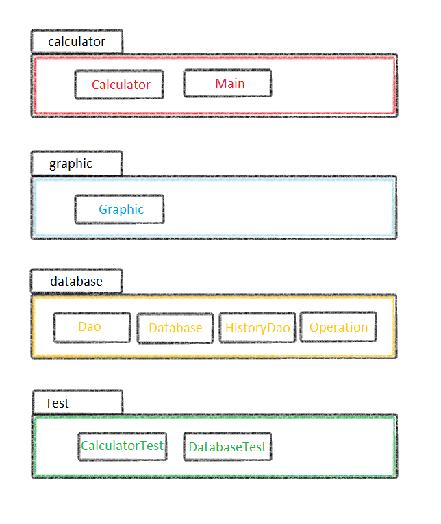
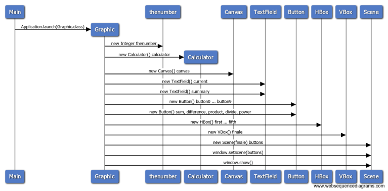
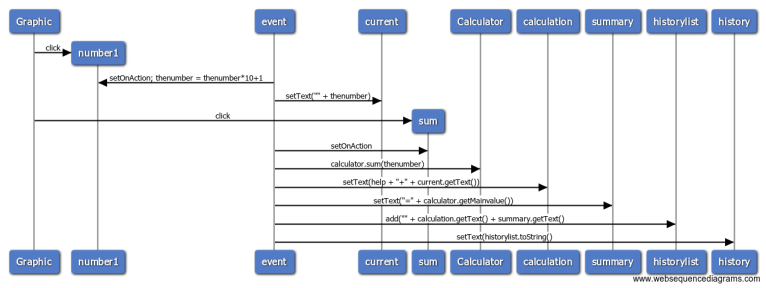

# Arkkitehtuurikuvaus

## Pakkausrakenne
Sovelluksen koodin pakkausrakenne on seuraava:
  
Pakkaus *Calculator* sisältää ohjelman sovelluslogiikan ja pakkaus *Graphic* taas graafisen käyttöliittymän. 
Pakkauksessa *Database* on sovelluksen käyttämään tietokantaan ja sen käyttöön liittyvät luokat.
Pakkauksen *Test* sisältä löytyy sovelluslogiikan kattavat testit, sekä tietokantaan liittyviä testejä.

## Sovelluslogiikka
Sovelluksen graafisen liittymän koostumista kuvaava sekvenssikaavio:
  
Ohjelma lähtee pyörimään, kun luokka *Main* kutsuu metodia *launch* luokalle *Graphic*. Tällöin *Graphic* lähtee rakentamaan
käyttäliittymää luomalla erinäisiä käyttäliittymään tarvittavia elementtejä.

Sovelluksen toiminnallisuutta kuvaava sekvenssikaavio:
  
Kaavion alussa käyttäjä klikkaa numeronappulaa 1. Tällöin *event* aktivoituu ja asettaa *TextField*in *current* tekstiksi kyseessä olevan numeron 1.
Seuraavaksi kaavion mukaan käyttäjä klikkaa nappia "+". Tämä saa aikaan uuden *event*in aktivoitumisen. Jo luodulle *Calculator*-oliolle kutsutaan
*Calculator*-luokan metodia *sum* parametrilla *thenumber*, mikä saa aikaan laskutoimituksen toteutumisen.
Tämän jälkeen asetetaan *TextField*eille syötetty arvo, annettu laskutoimitus sekä sen tulos. Koko lauseke
lisätään *history*-listalle, joka tulostetaan omalle *Label*illeen.