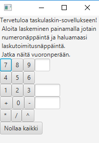

# Sovelluksen käyttöohje

Lataa tiedosto [Laskin-1.0-SNAPSHOT.3.jar](https://github.com/tviivi/otm-harjoitustyo/releases/tag/viikko6)

## Ohjelman käynnistäminen
Ohjelma voidaan käynnistää klikkaamalla latauspalkkiin ilmestyvää kuvaketta tai komennolla
`java -jar Laskin-1.0-SNAPSHOT.3.jar` projektin latauskansiossa.

## Ohjelman käyttäminen
Ohjelman käynnistyttyä aukeaa graafinen liittymä, josta löytyy laskimen alustavat käyttöohjeet.

Laskimen oikeaan yläreunaan tulostuu valittu numero, sen alapuolelle haluttu laskutoimitus ja lopulta tulos. Alareunaan tulostuu laskuhistoria, minkä voi nollata *Nollaa kaikki*-nappulalla. Laskimella voidaan laskea vain kokonaislukuja.