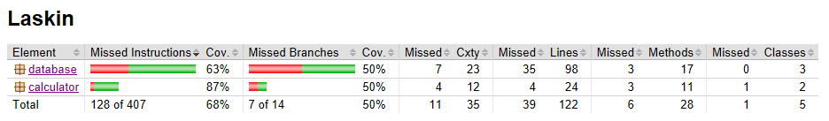

# Testausdokumentti

Ohjelmaa on testattu käyttäen *JUnit*:ia. Ohjelman luokkia *Calculator* sekä *Operation* on testattu kattavasti yksikkö- ja integraatiotestein.
Tietokantaluokalle *Database* on automaattiset testit. Myös luokalle *HistoryDao* on rakennettu noin puolet luokasta kattavat testit.

## Testauskattavuus
Ohjelman testauskattavuus on jäänyt luokan *HistoryDao* testauksen vähäisyydestä johtuen hieman liian alhaiseksi. Tämänhetkinen testauksen rivikattavuus on 68% ja haarautumakattavuus 50%. 
  