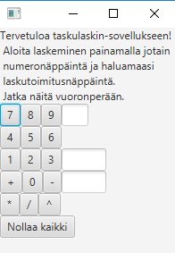

## Sovelluksen tarkoitus
Sovellus on apuna jokapäiväisessä laskennassa. Sovellusta on helppo käyttää, joten se sopii kaikille numeroista jotain ymmärtäville.

## Käyttöliittymä
Sovellus näyttää kaikessa yksinkertaisuudessaan seuraavalta:
  

## Perusversion toiminnallisuudet
*Toteutettu laskinsovellus sisältää peruslaskimen perustoiminnallisuudet*

- käyttäjä näkee laskimen ja ohjeistuksen sen sisältämään toiminnallisuuteen
- käyttäjä voi syöttää laskimeen vuoronperään numeroita ja laskutoimituskomentoja, jotka laskin laskee täsmällisesti oikein
- käyttäjä näkee syöttämiensä laskujen historian, jotka tallentuvat tietokantaan
- käyttäjä voi nollata laskuhistoriansa

## Jatkokehitysideoita
- funktionaalisten toimintojen toteuttaminen
- erilliset käyttäjäroolit (mahdollisuus normilaskimeen/funktionaaliseen laskimeen)
- muiden käyttäjien laskuhistorioiden selailu
- laskujen välivaiheiden tarkastelu halutessaan